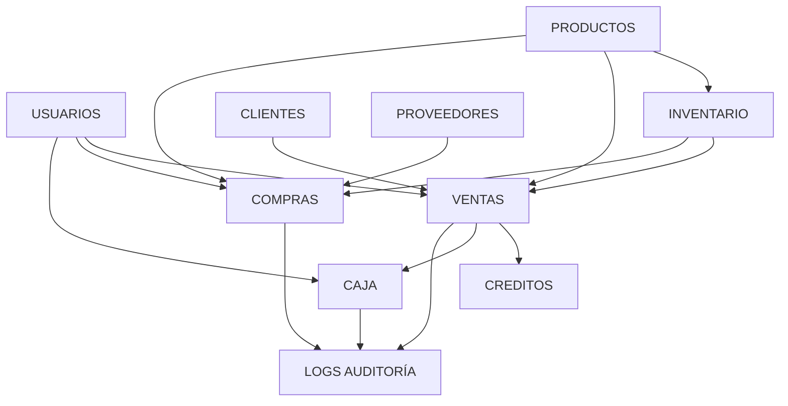

# 🏗️ INTRODUCCIÓN - BASE DE DATOS FERRETERÍA FRENAD

## 📋 Información General

**Sistema:** POS Ferretería Frenad  
**Base de Datos:** PostgreSQL 14+  
**Ubicación:** El Alto, La Paz - Bolivia  
**Zona Horaria:** America/La_Paz  
**Versión:** 1.0.0  
**Fecha de Creación:** Diciembre 2024

---

## 🎯 Objetivo

Diseñar e implementar una base de datos robusta, escalable y eficiente para gestionar todas las operaciones de una ferretería moderna, incluyendo:

- ✅ Gestión de inventario multi-almacén
- ✅ Punto de venta (POS)
- ✅ Control de ventas a crédito
- ✅ Gestión de compras y proveedores
- ✅ Control de caja diario
- ✅ Auditoría completa de operaciones

---

## 📊 Estadísticas Generales

| Métrica | Cantidad |
|---------|----------|
| **Tablas** | 25 |
| **Vistas** | 8 |
| **Funciones** | 11 |
| **Triggers** | 12 |
| **Índices** | 43 |
| **Seeders** | 7 |

---

## 🏛️ Arquitectura General

```
┌─────────────────────────────────────────────────────────┐
│                    SISTEMA POS FRENAD                    │
└─────────────────────────────────────────────────────────┘
                            │
        ┌───────────────────┼───────────────────┐
        │                   │                   │
   ┌────▼────┐        ┌────▼────┐        ┌────▼────┐
   │  AUTH   │        │ PRODUCTS│        │INVENTORY│
   │ Usuarios│        │Productos│        │ Almacén │
   │  Roles  │        │Categorías│       │  Stock  │
   └─────────┘        └─────────┘        └─────────┘
        │                   │                   │
        └───────────────────┼───────────────────┘
                            │
        ┌───────────────────┼───────────────────┐
        │                   │                   │
   ┌────▼────┐        ┌────▼────┐        ┌────▼────┐
   │  SALES  │        │PURCHASES│        │CUSTOMERS│
   │ Ventas  │        │ Compras │        │Clientes │
   │   POS   │        │Proveedores│      │Créditos │
   └─────────┘        └─────────┘        └─────────┘
        │                   │                   │
        └───────────────────┼───────────────────┘
                            │
                       ┌────▼────┐
                       │  CASH   │
                       │  Caja   │
                       │ Arqueos │
                       └────┬────┘
                            │
                       ┌────▼────┐
                       │  AUDIT  │
                       │  Logs   │
                       │Auditoría│
                       └─────────┘
```

---

## 🔐 Características de Seguridad

1. **Autenticación:**
   - Passwords hasheados con bcrypt
   - Sistema de roles N:N
   - Control de acceso granular

2. **Auditoría:**
   - Log completo de cambios
   - Campos `creado_por` / `actualizado_por`
   - Timestamps automáticos

3. **Integridad:**
   - Foreign Keys con acciones apropiadas
   - CHECK constraints en todas las tablas
   - Triggers de validación

---

## 🚀 Performance

1. **Índices Estratégicos:**
   - 43 índices optimizados
   - Índices GIN para búsqueda de texto
   - Índices parciales con WHERE

2. **Optimizaciones:**
   - Vistas materializadas para reportes
   - Funciones almacenadas para operaciones complejas
   - Transacciones atómicas

---

## 📈 Escalabilidad

- ✅ Diseño modular preparado para multi-sucursal
- ✅ Compatible con facturación electrónica
- ✅ Preparado para integración con sistemas externos
- ✅ Arquitectura lista para SaaS

---

## 📚 Convenciones de Nomenclatura

### **Tablas:**
- Nombres en plural y minúsculas
- Palabras separadas por guión bajo
- Ejemplo: `usuarios`, `detalle_ventas`, `ordenes_compra`

### **Columnas:**
- Nombres descriptivos en snake_case
- Sufijos estándar:
  - `_id` para foreign keys
  - `_en` para timestamps
  - `_por` para campos de auditoría

### **Funciones:**
- Verbos en infinitivo
- Snake_case
- Ejemplo: `procesar_venta()`, `calcular_utilidad_periodo()`

### **Vistas:**
- Prefijo `vista_`
- Nombre descriptivo
- Ejemplo: `vista_stock_actual`, `vista_ventas_hoy`

---

## 🔗 Relaciones entre Módulos



---

## 📖 Documentos Relacionados

- [Arquitectura Detallada](01-arquitectura.md)
- [Guía de Instalación](07-instalacion.md)
- [Módulos del Sistema](02-modulos/)
- [Funciones y Procedimientos](03-funciones/)

---

## ✅ Checklist de Implementación

- [x] Diseño de arquitectura
- [x] Creación de tablas
- [x] Definición de índices
- [x] Implementación de funciones
- [x] Configuración de triggers
- [x] Creación de vistas
- [x] Datos iniciales (seeders)
- [x] Scripts de migración
- [x] Documentación completa
- [ ] Testing exhaustivo
- [ ] Optimización de queries
- [ ] Backup y recuperación

---

